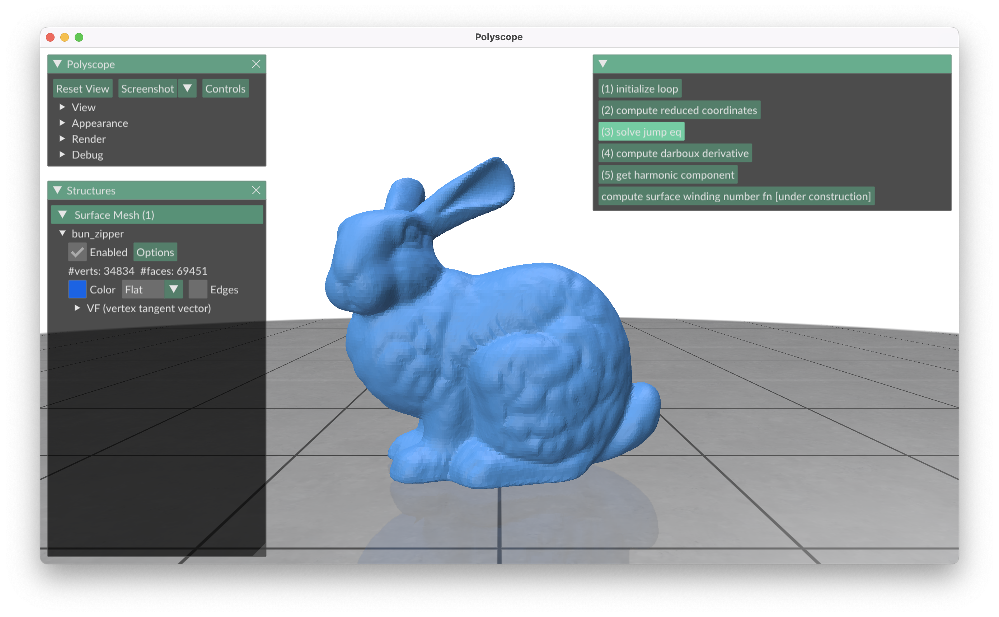

# Geometry Processing Final Project Report

## Table of Contents
0. [Tutorial](#tutorial)
1. [Introduction](#introduction)
2. [Methodology](#methodology)
3. [Results](#results)
4. [Discussion](#discussion)

## Tutorial

Dowload the code:
```
git clone --recursive https://github.com/1z1gh0st/gc-polyscope-project-template
```

Build the code:
```
cd gc-polyscope-project-template
mkdir build
cd build
cmake ..
make
```

Run the code:
```
❯ ./build/bin/gc_project data/bun_zipper.ply
```

## Introduction
In my project I attempted to recreate the fabulous results of Nicole Feng, Mark Gillespie, and Keenan Crane from Carnegie Mellon University. In their paper, "Discrete Winding Number on Surfaces" they detail the implementation of generalized winding number on to the surface of a discrete three dimensional mesh. This is a great achievement, and a remarkable further generalization of the use of winding number functions to determine the interior of boundary curves. Seeing this, I was inspired to create an implementation of this myself, so this is the basis of my final project.

## Methodology

In order to implement the algorithm, there are many subtasks that can be challenging in their own right, so my goals were not to, in any sense, re-invent the wheel. But rather, to focus on the key algorithms that make this exact surface winding number function come together. If you read the [paper itself](https://dl.acm.org/doi/10.1145/3592401), you will find that in the appendix the actually clearly list out most of these algorithms in pseudo-code. However, this still does not make the project a simple task, as one must take care to make sure that algorithm and the implementation actually match up one-to-one. With complex mesh traversal methods being used interchangeably, this is no small feat.

Let us begin by describing everything that I used in supporting my own implementation of this algorithm.

### Tools

- **Language**: C++11
- **Build System**: CMake
- **Mesh Library**: Geometry Central
- **Mesh Viewing**: Polyscope
- **GUI**: ImGui

### Implementation
So, using the example project provided by Geometry Central, I used this as a starting point. The first thing that I wanted to be able to do was to represent $\Gamma$ in code. So in order to do this, I use a hash map with an edge of the mesh as the key and an integer as the associated value. This will be the representation of 1-chains used here. Next, I wanted to implement the function `ComputeReducedCoordinates()`. Due to the implementation of the geometry-central library, the code itself is able to follow the provided pseudocode fairly closely.

#### Algorithm 2: `ComputeReducedCoordinates()`
```c++
// Input: A 1-chain Γ ∈ Z|𝐸| on a mesh 𝑀 = (𝑉,𝐸,𝐹).
// Output: A function 𝑐 ∈ Z|𝐶| expressing values at corners relative to some reference value .
hash<Corner, double> computeReducedCoordinates(hash<Edge, int> Gamma) {
    hash<Corner, double> c;
    for (Vertex i : interiorVertices(Gamma)) {
        if (!(i.isManifold())) {
            continue;
        }
        Halfedge ij0 = outgoingHalfedgeOnCurve(i, Gamma);
        Halfedge ij = ij0;
        int sum = 0;
        do {
            if (!(ij.edge().isBoundary())) {
                Vertex k = oppositeVertex(ij);
                int jump = ij.orientation() ? Gamma[ij.edge()] : -Gamma[ij.edge()];
                sum += jump;
                c[ij.corner()] = sum;
            }
            ij = ij.next().next().twin();
        }
        while (ij != ij0);
    }
    return c;
}
```
Over time, I understood the algorithm itself better and better, as well as gaining a good understanding of the fantastic geometry-central mesh processing library. Next was to implement the `BuildLaplacian()` function. As you can see, this function makes use of the halfedge data structure, which stores connectivity data similarly to the corner table implementation seen in homework three of the course.

#### Algorithm 5: `BuildLaplacian()`
```c++
vctr<vctr<double>> buildLaplacian(hash<Edge,int> Gamma) {
   vctr<vctr<double>> L(n, vctr<double>(n, 0));
    for (Face curr_face : mesh->faces()) {
        for (Corner curr_corner : curr_face.adjacentCorners()) {
            Vertex k = curr_corner.vertex();
            Vertex i = curr_corner.halfedge().next().vertex();
            Vertex j = curr_corner.halfedge().next().next().vertex();
            bool skip_corner = false;
            for (Vertex other : endpointsOf(Gamma)) {
                if (other == i || other == j) {
                    skip_corner = true;
                    break;
                }
            }
            if (!skip_corner) {
                int idx_i = i.getIndex();
                int idx_j = j.getIndex();
                double theta = geometry->cornerAngle(curr_corner);
                double temp_laplacian_val = 0.5 * (1 / std::tan(theta));
                L[idx_i][idx_i] += temp_laplacian_val;
                L[idx_j][idx_j] += temp_laplacian_val;
                L[idx_i][idx_j] -= temp_laplacian_val;
                L[idx_j][idx_i] -= temp_laplacian_val;
            }
        }
    }
    return L;
}
```
Similarly, I must get the right-hand side of the linear system that we put into the sparse linear system solver query call. So in order to do this, I implemented the following algorithm as per the pseudocode of the paper:
#### Algorithm 6: `BuildJumpLaplaceRHS()`
```c++
// Input: A 1-chain Γ ∈ Z|𝐸 | on a mesh 𝑀 = (𝑉 , 𝐸, 𝐹 ) with corner angles 𝜃 , and reduced coordinates 𝑐 ∈ R|𝐶 | (Section 2.3.1).
// Output: The vector 𝑏 ∈ R|𝑉 ∗ | in Equation 10.
vctr<double> buildJumpLaplaceRHS(hash<Edge,int> Gamma, hash<Corner,double> c) {
    vctr<double> b(n, 0);
    for (Vertex curr_vert : interiorVertices(Gamma)) {
        for (Corner curr_corner : curr_vert.adjacentCorners()) {
            Vertex i = curr_corner.vertex();
            Vertex j = curr_corner.halfedge().next().vertex();
            Vertex k = curr_corner.halfedge().next().next().vertex();
            bool skip_corner = false;
            for (Vertex endpoint_vert : endpointsOf(Gamma)) {
                if (j == endpoint_vert || k == endpoint_vert) {
                    skip_corner = true;
                    break;
                }
            }
            Corner k_centered_corner = curr_corner.halfedge().next().next().corner();
            Corner j_centered_corner = curr_corner.halfedge().next().corner();
            if (!skip_corner) {
                b[i.getIndex()] -= 0.5 * (1 / std::tan(geometry->cornerAngle(k_centered_corner))) * c[curr_corner];
                b[j.getIndex()] += 0.5 * (1 / std::tan(geometry->cornerAngle(k_centered_corner))) * c[curr_corner];
                b[i.getIndex()] -= 0.5 * (1 / std::tan(geometry->cornerAngle(j_centered_corner))) * c[curr_corner];
                b[k.getIndex()] += 0.5 * (1 / std::tan(geometry->cornerAngle(j_centered_corner))) * c[curr_corner];
            }
        }
    }
    return b;
}
```

This gives a sample of the code written to implement the algorithms detailed in the authors' paper. To see the full implementation please download the project files and read through `main.cpp`. All of the logic is containted there.

## Results



Although the majority of the algorithms do have an implementation, there are runtime errors abound and there is still much debugging to do. Thus far in my work, it seems to get decently far through the algorithm, although with what degree of correctness it is somewhat difficult for me to verify. All of the following tasks are being completed:

- Meshes are loaded into the program and visualized.
- Loops for $\Gamma \in \mathbb{Z}^{|E|}$ are being initialized.
- The reduced coordinates $c \in \mathbb{Z}^{|C|}$ are being computed.
- The initail jump equation $u \in \mathbb{R}^{|C|}$ is being computed, hence the laplacian $L$ and the RHS of our linear system $b$ are also being computed.
- The Darboux derivative is being computed.

The step that follows is where there are runtime errors of which I have not yet been able to debug.

Here is the output thus far:
```
❯ ./build/bin/gc_project data/bun_zipper.ply
[polyscope] Backend: openGL3_glfw -- Loaded openGL version: 4.1 Metal - 88
Loop initialized!
Gamma[e_0]=1
Gamma[e_1]=1
Gamma[e_2]=1
Gamma[e_3]=1
Gamma[e_4]=1
Reduced coordinates computed!
c[c_0]=1
c[c_1]=-1
c[c_3]=-1
c[c_7]=-1
c[c_1653]=-1
c[c_5913]=-1
c[c_5914]=-1
c[c_7451]=-1
c[c_76058]=-1
c[c_76063]=-1
c[c_77743]=-1
c[c_81856]=-1
c[c_139531]=-1
c[c_188085]=-1
c[c_201481]=-1
...
```
The next step of solving the jump equation takes much much longer, but it does eventually complete.
```
Initial jump equation solved!
u[c_0]=1
u[c_1]=-1
u[c_3]=-1
u[c_7]=-1
u[c_1653]=-1
u[c_5913]=-1
u[c_5914]=-1
u[c_7451]=-1
u[c_76058]=-1
u[c_76063]=-1
u[c_77743]=-1
u[c_81856]=-1
u[c_139531]=-1
u[c_188085]=-1
u[c_201481]=-1
...
```
And the next step takes longer still, but does eventually terminate:
```
...
Edge e_104222 has value 0 in function omega : E -> R
Edge e_104223 has value 0 in function omega : E -> R
Edge e_104224 has value 0 in function omega : E -> R
Edge e_104225 has value 0 in function omega : E -> R
Edge e_104226 has value 0 in function omega : E -> R
Edge e_104227 has value 0 in function omega : E -> R
Edge e_104228 has value 0 in function omega : E -> R
Edge e_104229 has value 0 in function omega : E -> R
Edge e_104230 has value 0 in function omega : E -> R
Edge e_104231 has value 0 in function omega : E -> R
Edge e_104232 has value 0 in function omega : E -> R
Edge e_104233 has value 0 in function omega : E -> R
Edge e_104234 has value 0 in function omega : E -> R
Edge e_104235 has value 0 in function omega : E -> R
Edge e_104236 has value 0 in function omega : E -> R
Edge e_104237 has value 0 in function omega : E -> R
Edge e_104238 has value 0 in function omega : E -> R
Edge e_104239 has value 0 in function omega : E -> R
Edge e_104240 has value 0 in function omega : E -> R
Edge e_104241 has value 0 in function omega : E -> R
Edge e_104242 has value 0 in function omega : E -> R
Edge e_104243 has value 0 in function omega : E -> R
...
```
Admittedly, this output should omit values with 0, but at least it is proof that this function terminates. It is at the next step that the program crashes:
```
libc++abi: terminating due to uncaught exception of type std::runtime_error: GC_SAFETY_ASSERT FAILURE from /MY_PATH/gc-polyscope-project-template/deps/geometry-central/src/../include/geometrycentral/surface/vertex_position_geometry.ipp:67 - faces must be triangular
[1]    24920 abort      ./build/bin/gc_project data/bun_zipper.ply
```
This is a curious error, as I thought each triangle in the bunny mesh I had was triangular, so I will want to ensure that this is case somewhere prior in code to avoid this runtime error. That is, assuming that this is truly the cause of the error!

## Discussion
Working on this process has been fruitful and quite illustrative, though I regret that it is not in a complete state at the time of writing. I intend to continue my work and finish this implementation over the coming weeks. I believe the use of matrices from the [Eigen library]() will be much more efficient regarding implementation, and I will be able to solve the errors I am currently getting through a careful debugging process. Furthermore, I can serialize and dump all info on the various functions that I compute on different mesh data structures. Then I can compare these results with the author's implementation, and see if I am getting the same results. Hopefully, the scope of this project need not expand much further, and the program will be working soon!

## References

Started project based on [this template](https://github.com/nmwsharp/gc-polyscope-project-template) courtesy of @nmwsharp on github.

The wonderful design of the [geometry-central library](https://geometry-central.net/) has made this project much more feasable for me than I would have previously thought.

Of course, [the paper I'm implementing here](https://dl.acm.org/doi/10.1145/3592401) from Feng et. al. is a major reference for this project.

---

*Author: [Philip Warton]*  
*Date: [03/22/2024]*  
*Institution: [Oregon State University]*  
*Course: [CS 554 - Geometric Modeling in Computer Graphics]*  
*Instructor: [Eugene Zhang]*
